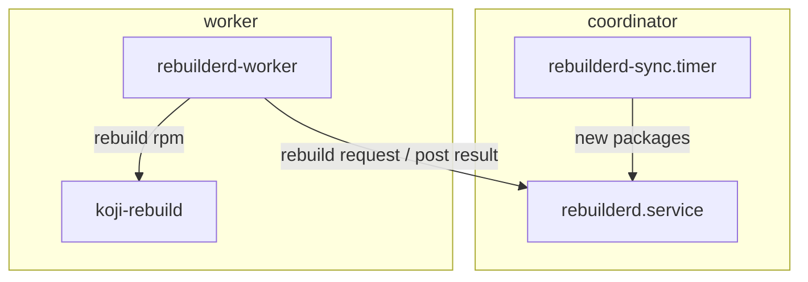

# Fedora rebuilderd setup

## Rebuilderd

[Rebuilderd](https://github.com/kpcyrd/rebuilderd/) is an open source project aimed to provide a service to reproduce binary artifacts. It consists out of three parts the `rebuilderd` daemon, `rebuilderd-worker` and a scheduler.

A graph overview:

The rebuilderd daemon backed by a SQLite database serves an http api which a systemd timer uses to feed new packages into the database to be rebuild. Rebuilderd workers connect to the same http api, grab a job from queue to rebuild, kick off the configured rebuild tool and report a status back to rebuilderd.

Workers can be dynamically added or removed, but it is unknown what happens when a worker is stopped when having picked up a job.

## Ansible
